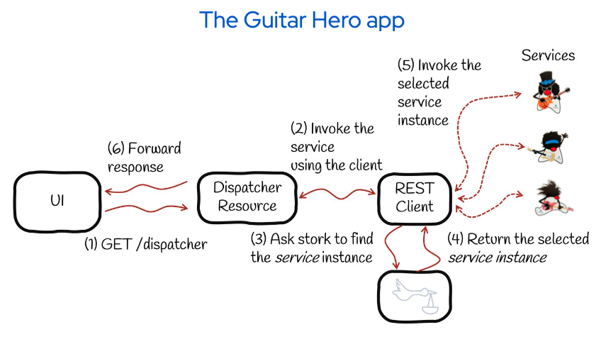

# Spring Stork guitar hero

This is a demo project for Spring Boot developers wanting to use Smallrye Stork for service discovery and instance selection.
This project uses Spring Boot framework.

If you want to learn more about Spring Boot, please visit its website: https://spring.io/projects/spring-boot .


The following picture represents our system: it's a very simple application with an UI which is calling a dispatcher resource API. Dispatcher resource is calling a Guitar hero service running remotely. The dispatcher service use the Rest Client for that and Rest Client as shown in the picture is going to delegate to Stork the SD and instance selection.
The Guitar hero service provides 3 instances: Slash, Jimi Hendrix and Eddie Van Halen.




Slash instance returns the slash version of duke.
The hendrix instance returns the Jimmy hendrix one and is slightly slower than the Slash service.
Finally, the Eddie service is the fatests but with a 20% chance of failing.

We will use Stork when the Dispatcher service need to invoke the remote service: Stork will locate this service. This steps retrieves 3 service instances, then we need to pick one, thats where the Stork load balancing capability comes into play for selecting one according to different strategies.

## Running the application in dev mode

You can run your application in dev mode that enables live coding using:
```shell script
./mvnw spring-boot:run
```

If everything went well the application should be accessible in http://localhost:8081/

## Packaging and running the application

The application can be packaged using:

```shell script
./mvnw package
```
It produces the `spring-guitar-hero-0.0.1-SNAPSHOT.jar` file in the `target/` directory.

The application is now runnable using `java -jar target/spring-guitar-hero-0.0.1-SNAPSHOT.jar`.


### Reference Documentation
For further reference, please consider the following sections:

* [Smallrye Stork Spring Boot configuration integration](http://smallrye.io/smallrye-stork/latest/springboot-config/)
